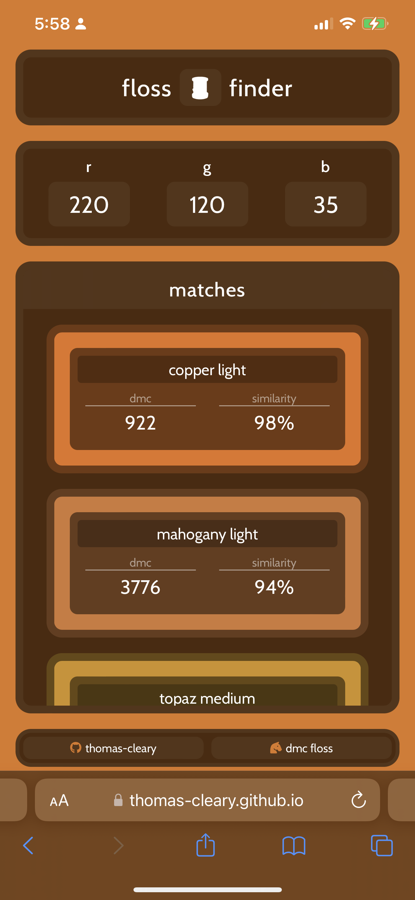

# floss-finder
 
🧵 A tool to match RGB values with DMC floss colours
- https://thomas-cleary.github.io/floss-finder/

### Why?
To apply what I have learnt so far via:
  - **The Odin Project**
    - [Foundations](https://www.theodinproject.com/paths/foundations/courses/foundations)
      
  - **Full Stack Open**
    - [Part 1](https://fullstackopen.com/en/part1)
    - [Part 2](https://fullstackopen.com/en/part2)

 

